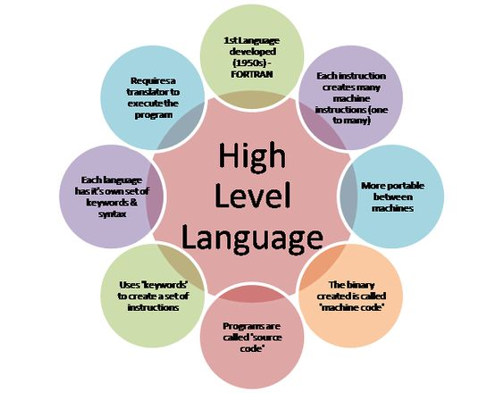

# holbertonschool-higher_level_programming

Source: s1school.net

## What is this repository about?
This repository contains projects for learning programming in a higher level language.

In these projects I learned Python, Javascrypt and MySQL.

To all this, it is important that we ask ourselves, what is a high-level programming language?

A high-level programming language is a programming language with a strong abstraction of computer details. While low-level programming languages can use elements of natural language, be easier to use, or can automate (or even completely hide) important areas of computer systems (e.g. memory management), making the process of developing a program simpler and more understandable than when using a low-level language. The amount of abstraction provided defines how "high" a programming language is.

## Author
* Diego Betancourt | [GitHub](https://github.com/dfbq91) | [LinkedIn](https://www.linkedin.com/in/diegofernandobetancourtquintero/) | [Twitter](https://twitter.com/diegobtancourt)

